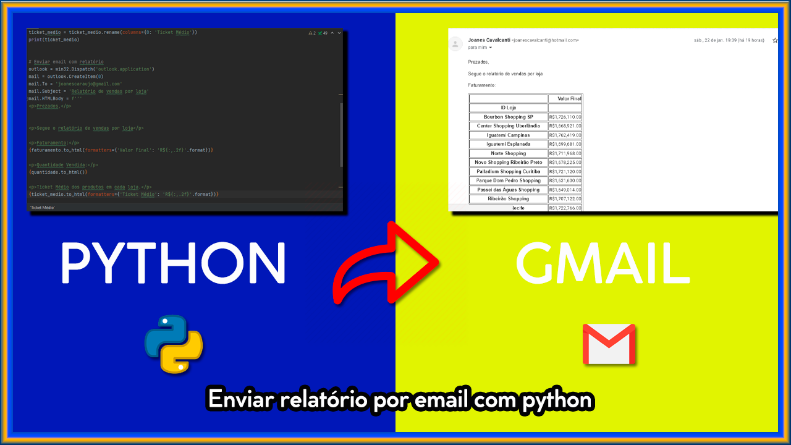

# 👨‍💻️ Minicurso Python de automação.

- Criação de um mini projetinho, onde iremos tratar os dados, criar relatório e enviar por e-mail de forma automatizada. 

    <ol>
     <li>Importar a base de dados</li>
     <li>Visualizar a base de dados</li>
    </ol>

- Agora iremos tratar os dados e gerar o relatório pedido. 

     <ol>
         <li>Faturamento por loja</li>
         <li>Quantidade de produtos vendidos por loja</li>
         <li>Ticket Médio de produtos por loja</li>
         <li>Enviar email com relatório</li>
    </ol>

